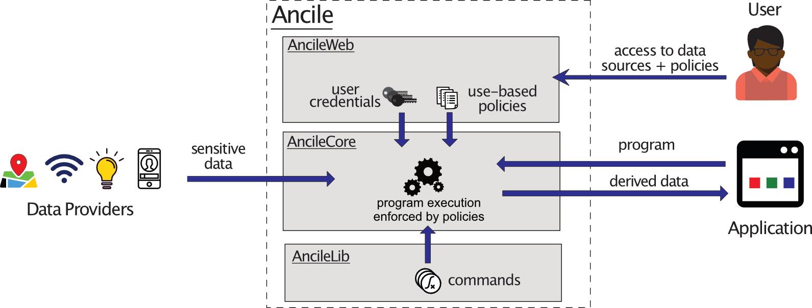

# Ancile - Use-Based Privacy for applications

Make documentation: `cd docs && make html`

Ancile is a framework that enables control over application's
data usage with privacy policies. We currently support Python and 
work with any OAuth service. Essentially, our system is a middleware 
between the data source (e.g. mail server, location data server, etc)
and some application created by the third-party.  

Our system allows the application to submit an arbitrary Python program that
requests data from the data source. Ancile upon getting this program fetches
the policy and access tokens associated with the user and the data source.
Ancile attempts to execute application's program in a restricted environment
enforcing the policies. If the program completes without policy violations the 
result of the program is returned back to the application.

**Use-based privacy** ([Birrell et al.](https://www.cs.cornell.edu/fbs/publications/UBP.avanance.pdf))
focuses on preventing harmful uses (**[NYTimes](https://www.nytimes.com/interactive/2018/12/10/business/location-data-privacy-apps.html)**)
rather than restricting 
access to data. The application gets to use all necessary data for non-harmful
purposes. Each datapoint in Ancile has a policy that specifies what uses 
are permitted. Furthermore, this framework utilizes **reactive** approach meaning 
that after performing transformations on data policy will change. 

## Use Case
  
Let's consider an application that tracks a professor and notifies
students of professor's location during dedicated office hours.
The location service collects fine-grained information on 
user's whereabouts. Unrestricted release of raw data can lead
to malicious uses where the professors location is accessed after hours 
or outside of the campus. Ancile can address this problem by defining a policy
on professor's location data that shares data only at specific hours or 
at the specific location.

## Policy language

Policies define an automata that changes on operations with data. For example, 
applying transformation that fuzzes the location can enable a bigger set of 
further operations on this data.

Our policy is defined as a regular expression over an alphabet of operations 
(Python commands) using the following operations:

1. **Sequence** -- `commandA . commandB` declares that the program has two call
`commandB` only after calling `commandB`. 
2. **Union** -- `commandA + commandB` either of both commands can be invoked.
3. **Intersection** -- `commandA & commandB` both commands need to match.
4. **Iteration** -- `commandA*` command can be repeated multiple times.
5. **Negation** -- `!commandA` can be any command except `commandA`.

We use **[Brzozowski derivatives](https://en.wikipedia.org/wiki/Brzozowski_derivative)**
approach that allows to advance the regular expression when calling a command.

## Installation

Here are the installation [Instructions](docs/source/installation.md).

We have a development environment running at https://dev.ancile.smalldata.io 
so please free to explore it. 
