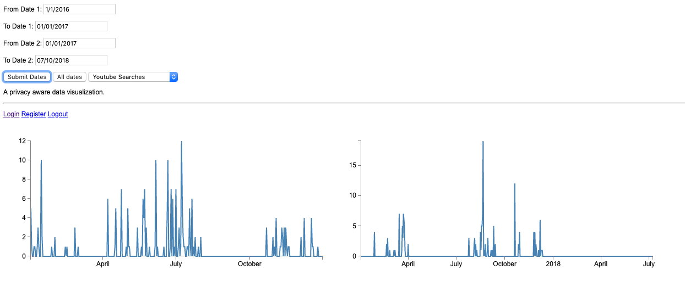
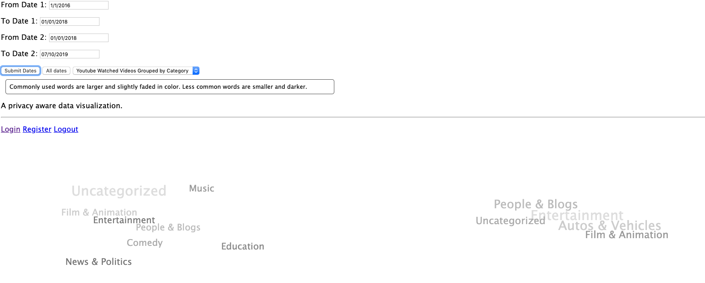
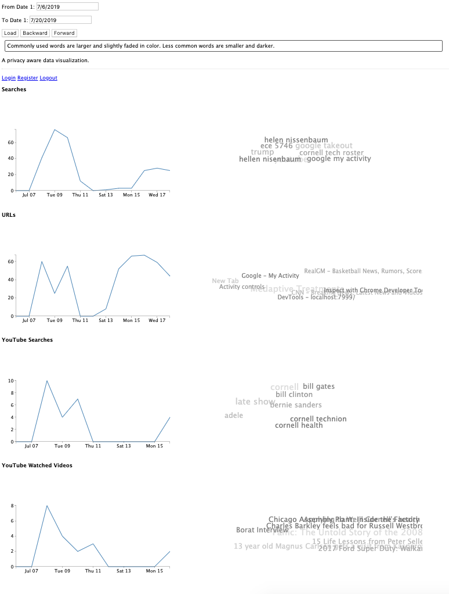

Integrating Ancile with RDL and Tealeaves Suite

Background

RDL (Retrospective Data Learning) is a web application that allows users to submit Google Takeout Archives and extracts data from it (e.g. URLs visited, browser history, location history). RDL exposes data via OAuth2 APIs - Ancile can consume these by adding RDL as a data provider. Finally, the Tealeaves Suite consists of 3rd Party apps (e.g. tealeaves, teacloud, memorylane) that use Ancile to fetch, transform, aggregate, and filter RDL data to create visualizations. All apps in the Tealeaves Suite have application accounts on Ancile; they also belong to policies that encompass users, RDL (as a data provider), and the apps themselves. 

Adding RDL as a Data Provider to Ancile

Info in the document titled "How to Set Up RDL as a Data Provider to Ancile.pdf"

Adding the Tealeaves Suite as 3rd Party Applications in Ancile

1. Create an app account in Ancile for each application

2. Log in as a user in Ancile and add a policy for each application. Use RDL as the dataprovider and set active to true. For simplicity, can set policies to ANYF*

3. Run the applications themselves, and register a user with the same e-mail address as the Ancile user account from the previous step. 

4. Replace the JWT token in the 3rd Party Application programs with the Ancile Application’s JWT token on your Ancile Instance.

5. Get a YouTube API Key, and add it to your Ancile config yaml under api_keys -> YOUTUBE_API_KEY. Ancile uses it to get video categories from YouTube videos.

    1. Instructions available here: https://developers.google.com/youtube/v3/getting-started

That’s It!

Make sure RDL, Ancile, and the Tealeaves Application(s) are all running, and some beautiful visualizations should appear for the user!

Appendix

* RDL functions in Ancile Core (ancile_core/functions/rdl.py)

    * Fetch functions to retrieve usage stats, urls visited, YouTube searches, and YouTube watched videos

    * Aggregation functions to transform a list of (data, timestamp) pairs into (count, day) pairs or (data, count, day) triples. Data can be urls, web searches, YouTube searches, YouTube watched video urls, and YouTube watched video categories.

    * A political filter function that filters out political terms from data. 

    * A YouTube categorization function that adds in YouTube video categories to the YouTube watched videos data using the YouTube API.

Screenshots

Tealeaves

Teacloud

Memorylane

